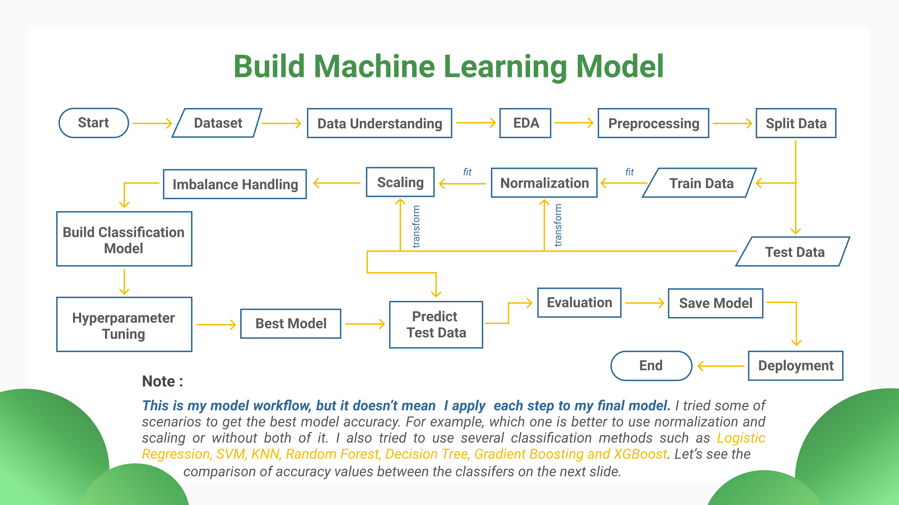
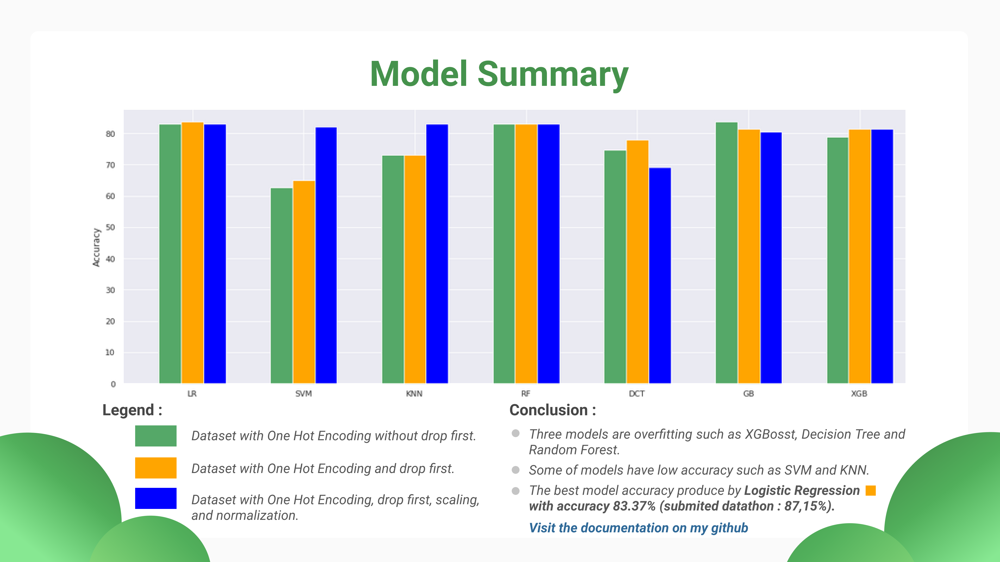

# Machine Learning Advanced Bootcamp by DPhi

<a href="https://dphi.tech/">DPhi is a community</a> with a vision to build data culture and democratize Data Science learning. This community helps data enthusiast to get free data science bootcamp with superb speakers, coachs and mentors. Honestly, this bootcamp really helped me to understand how to build my first end-to-end machine learning project and deploy that project in heroku server using flask. So, In this repository I want share to you what I got for 1 month bootcamp <i>(Machine Learning Advanced Bootcamp)</i> in this comunity. Hope it can helps you more familiar with every steps of building end-to-end machine learning project.

**Bootcamp Subject:**
- Introduction to Numpy and Pandas
- Exploratory Data Analysis Using Matplotlib and Seaborn 
- Data Preprocessing
- Make Our First Regression Model
- Feature Selection
- Explainable AI
- Build Machine Learning Model Using Pycaret Library
- Save Machine Learning Model Using Pickle
- My Final Machine Learning project website ~ <a href="https://dphi-loan-predict.herokuapp.com/">Loan Approval</a>
- Complete Repository For my Final Project, <a href="https://github.com/irwanafandi24/Loan_Model_Deployment">visit here!</a>

**Project Overview**

**Model Summary**

##

I highly recommend you to visit the <a href="https://dphi.tech/">website</a> because you can got a lot of modules and videos about machine learning and deep learning. It is free, so what are you waiting for?
 

🎉 <b>Let's,</b> build our first End-to-End Machine Learning Project 🎉
